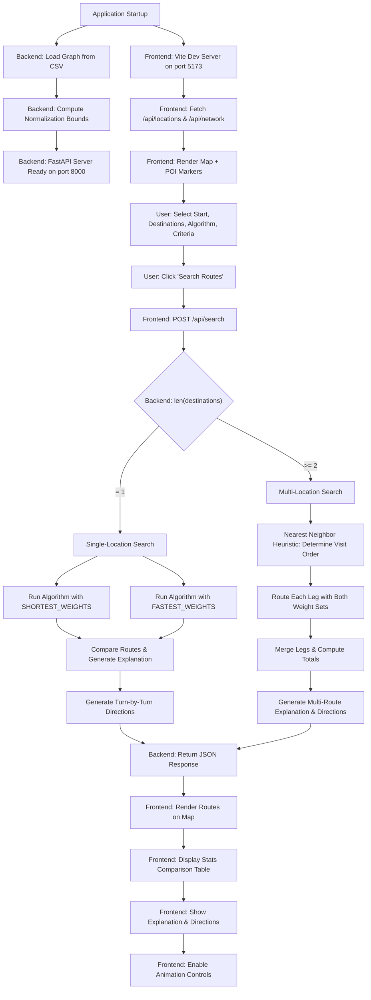
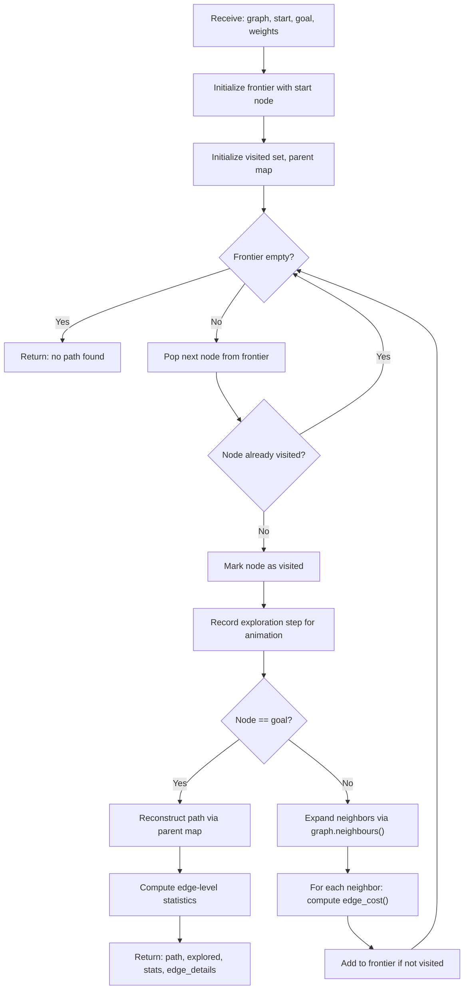
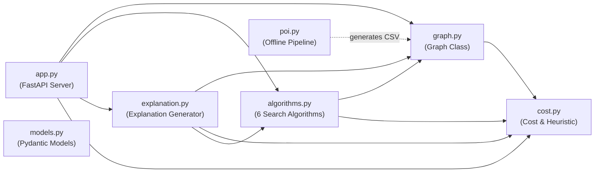
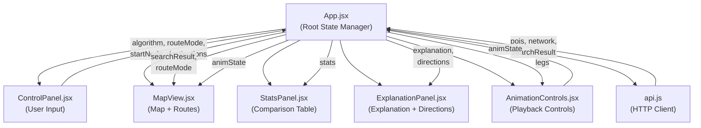
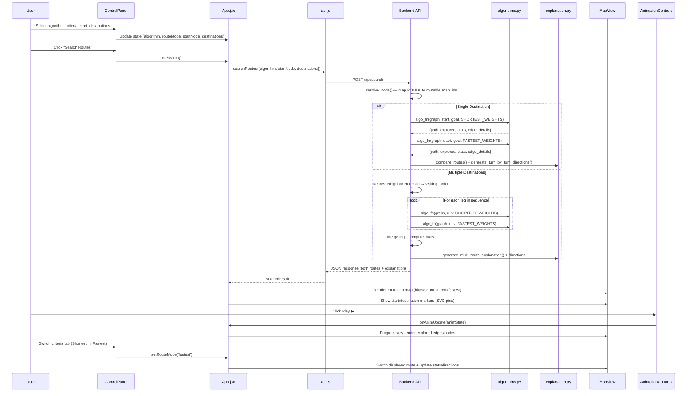

# Program Documentation — Tourist Route Planner

**Project:** Tourist Route Planner — District 1, Ho Chi Minh City  
**Course:** CSC14003 — Introduction to Artificial Intelligence  
**Group:** G10

---

## f. Program Flow

### f.1 System Architecture Overview

The system follows a **client–server architecture** with two independent parts communicating over a REST API:

| Layer | Technology | Responsibility |
|---|---|---|
| **Frontend** | React 18 + Vite + MapLibre GL JS | User interface, map rendering, animation, statistics display |
| **Backend** | Python 3.9+ + FastAPI + Uvicorn | Graph loading, search algorithms, route comparison, explanation generation |
| **Data** | `processed_nodes.csv`, `processed_edges.csv` | Pre-extracted District 1 road network from OpenStreetMap via OSMnx |

The two layers never share memory or internal state. Every interaction is a single HTTP request from the Frontend followed by a single JSON response from the Backend.

---

### f.2 High-Level Program Flow

The following diagram describes the main processing flow from application startup through user interaction to result display:



---

### f.3 Search Algorithm Execution Flow

Each search algorithm follows this general execution pattern, with variations in frontier data structure and expansion strategy:



The specific frontier structures used by each algorithm are:

| Algorithm | Frontier | Priority Key | Optimality |
|---|---|---|---|
| **BFS** | `deque` (FIFO queue) | Insertion order | Not optimal (ignores weights) |
| **DFS** | `list` (LIFO stack) | Insertion order (reversed) | Not optimal, not complete |
| **UCS** | `heapq` (min-heap) | Cumulative path cost `g(n)` | ✓ Optimal |
| **A\*** | `heapq` (min-heap) | `f(n) = g(n) + h(n)` | ✓ Optimal (admissible heuristic) |
| **Greedy Best-First** | `heapq` (min-heap) | Heuristic only `h(n)` | Not optimal |
| **Bidirectional BFS** | Two `deque` queues | Alternating expansion | Not optimal (BFS-based) |

---

### f.4 Main Modules, Functions, and Program Structure

#### f.4.1 Backend Modules

```
backend/
├── app.py           — FastAPI server, API endpoints, request routing
├── graph.py         — Graph data structure, CSV loading, adjacency list
├── algorithms.py    — 6 search algorithm implementations
├── cost.py          — Cost function, min-max normalization, heuristic
├── explanation.py   — Route comparison, NL explanation, turn-by-turn directions
├── models.py        — Pydantic request/response schemas
├── poi.py           — Offline OSMnx data extraction pipeline
└── requirements.txt — Python dependencies
```

**Module Dependency Diagram:**



##### `graph.py` — Graph Class

| Method | Description |
|---|---|
| `Graph.load(data_dir)` | Reads `processed_nodes.csv` and `processed_edges.csv`, builds in-memory adjacency list, computes normalization bounds |
| `Graph._load_nodes(path)` | Parses node CSV → `self.nodes: Dict[int, dict]` mapping node ID to `{lat, lon, type, name, snap_id}` |
| `Graph._load_edges(path)` | Parses edge CSV → `self.adj: Dict[int, List[Tuple[int, dict]]]` adjacency list with full edge attributes including geometry |
| `Graph._compute_bounds()` | Iterates all edges to compute `NormBounds` (min/max for distance, time, congestion, risk) |
| `Graph.neighbours(node_id)` | Returns `[(neighbour_id, edge_dict), ...]` for graph traversal |
| `Graph.get_pois()` | Returns filtered list of POI nodes with physical and snapped coordinates |
| `Graph.get_all_nodes()` / `get_all_edges()` | Returns full node/edge data for network rendering |

##### `cost.py` — Cost Function

| Component | Description |
|---|---|
| `SHORTEST_WEIGHTS = (1.0, 0.0, 0.0, 0.0)` | Weight tuple emphasizing distance only |
| `FASTEST_WEIGHTS = (0.05, 0.65, 0.20, 0.10)` | Weight tuple emphasizing time, congestion avoidance, and risk |
| `NormBounds` dataclass | Stores global `d_min/d_max`, `t_min/t_max`, `c_min/c_max`, `r_min/r_max` |
| `edge_cost(edge, weights, bounds)` | Computes `w_d·d̂ + w_t·t̂ + w_c·ĉ + w_r·r̂` where each component is min-max normalized |
| `heuristic_cost(lat1, lon1, lat2, lon2, weights, bounds)` | Admissible heuristic using Haversine distance, normalized by global bounds, multiplied by minimum non-zero weight |

##### `algorithms.py` — Search Algorithms

| Function | Signature | Key Characteristic |
|---|---|---|
| `bfs(graph, start, goal, weights)` | BFS with FIFO `deque` | Expands level by level; ignores edge weights |
| `dfs(graph, start, goal, weights)` | DFS with LIFO `list` | Explores depth-first; may find non-optimal path |
| `ucs(graph, start, goal, weights)` | UCS with `heapq` priority queue | Expands by cumulative `edge_cost`; guarantees optimality |
| `astar(graph, start, goal, weights)` | A* with `f = g + h` | Uses `heuristic_cost` for informed expansion; optimal with admissible heuristic |
| `gbfs(graph, start, goal, weights)` | Greedy BFS with `heapq` | Expands by heuristic only; fast but not optimal |
| `bidirectional(graph, start, goal, weights)` | Two-frontier BFS | Builds reverse adjacency; searches from both ends simultaneously |
| `_build_result(path, explored, ...)` | Common result builder | Computes `total_distance`, `total_time`, `total_congestion`, `total_risk`, `total_cost`, `expanded_nodes`, `execution_time` |
| `_reconstruct(parent, goal)` | Path reconstruction | Traces parent pointers from goal to start |

All six algorithms are registered in the `ALGORITHMS` dictionary and share a common function signature `(graph, start, goal, weights) → dict`, enabling uniform invocation from the API layer.

##### `explanation.py` — Explanation & Directions

| Function | Description |
|---|---|
| `compare_routes(graph, algorithm_key, start, goal)` | Runs the chosen algorithm with both `SHORTEST_WEIGHTS` and `FASTEST_WEIGHTS`, identifies congested segments, generates comparative explanation |
| `_generate_explanation(shortest, fastest, ...)` | Produces natural-language comparison: distance diff, time diff, congestion analysis, and recommendation |
| `generate_multi_route_explanation(...)` | Produces explanation for multi-destination tours including per-leg and total statistics |
| `generate_turn_by_turn_directions(graph, edge_details, destinations_info, start_info)` | Groups consecutive edges by street name, computes bearing angles between segments, and generates turn-by-turn instructions (go straight, turn left/right, U-turn, arrive) |

##### `app.py` — API Endpoints

| Endpoint | Method | Description |
|---|---|---|
| `/api/locations` | `GET` | Returns all POI nodes with names and coordinates for the dropdown selector |
| `/api/network` | `GET` | Returns full road network as GeoJSON `FeatureCollection` for map rendering |
| `/api/search` | `POST` | Main search endpoint: accepts `{algorithm, start_node, destinations}`, auto-detects single vs. multi-location mode, returns both shortest and fastest routes with comparison |

Key internal functions in `app.py`:

| Function | Description |
|---|---|
| `_resolve_node(nid)` | Resolves physical POI node ID to its routable `snap_id` on the road network |
| `_path_to_coords(path)` | Converts node ID list to `[[lon, lat], ...]` coordinate array following detailed edge geometry curves for accurate map rendering |
| `_multi_location_search(algorithm, start, destinations)` | Implements Nearest Neighbor ordering → per-leg routing → leg merging → total statistics computation |
| `_haversine(node_a, node_b)` | Computes great-circle distance between two graph nodes for nearest-neighbor selection |

#### f.4.2 Frontend Modules

```
frontend/src/
├── main.jsx                 — React entry point, renders <App />
├── App.jsx                  — Root component, state management, data fetching
├── App.css                  — Global styles (glassmorphism design system)
├── components/
│   ├── ControlPanel.jsx     — Algorithm/criteria selector, start/destination inputs
│   ├── MapView.jsx          — MapLibre GL JS map with route/network rendering
│   ├── StatsPanel.jsx       — Shortest vs. Fastest comparison table
│   ├── ExplanationPanel.jsx — NL explanation display + turn-by-turn directions
│   └── AnimationControls.jsx — Play/pause/reset/speed for exploration animation
└── utils/
    ├── api.js               — HTTP client (fetchLocations, fetchNetwork, searchRoutes)
    └── animation.js         — Animation utility helpers
```

**Component Hierarchy:**



##### Key Frontend Components

| Component | Key Props | Responsibility |
|---|---|---|
| **`App.jsx`** | — | Root state management: holds `pois`, `network`, `algorithm`, `startNode`, `destinations`, `searchResult`, `animState`, `routeMode`. Orchestrates data flow between all children. |
| **`ControlPanel.jsx`** | `pois`, `algorithm`, `routeMode`, `startNode`, `destinations` | Renders algorithm dropdown (6 options), criteria selector (Shortest/Fastest), start location dropdown, dynamic destination list with add/remove buttons, and Search/Reset action buttons. |
| **`MapView.jsx`** | `network`, `searchResult`, `routeMode`, `animState`, `pois` | Initializes MapLibre GL JS with CARTO Voyager basemap centered on District 1. Renders: road network debug overlay (color-coded by road type), POI markers (SVG pins), route polylines with directional arrows, exploration animation edges/nodes. Supports shortest (blue) and fastest (red) route display. |
| **`StatsPanel.jsx`** | `shortestStats`, `fastestStats`, `routeMode` | Displays a 7-row comparison table: Distance, Travel Time, Congestion, Risk Score, Total Cost, Expanded Nodes, Execution Time. Each metric is badge-styled with winner (✓ green) and loser (red) indicators. Column headers are clickable to switch `routeMode`. |
| **`ExplanationPanel.jsx`** | `explanation`, `algorithmInfo`, `shortestDirections`, `fastestDirections` | Renders algorithm properties badges (Optimal/Approximate, Complete/Incomplete), the natural-language route explanation with Markdown bold formatting, and tabbed turn-by-turn navigation directions with directional icons (🚩 ⬆️ ↗️ ↖️ ↩️ 📍). |
| **`AnimationControls.jsx`** | `legs`, `onAnimUpdate` | Floating playback bar with Play/Pause, Reset, progress bar, step counter (`N / total`), and speed cycle button (0.5×, 1×, 2×, 5×, 10×). Flattens exploration steps across legs, pauses at leg boundaries for multi-location animation. |

---

### f.5 GUI–Algorithm Interaction Flow

The following diagram and description explain how the GUI interacts with the search algorithms:



#### Detailed Interaction Description

1. **User Input → State Update:**  
   The user interacts with `ControlPanel` to select an algorithm from the dropdown (A\*, UCS, BFS, DFS, Greedy BFS, Bidirectional), choose a routing criteria (Shortest or Fastest), pick a start location, and add one or more destinations. Each selection immediately updates React state in `App.jsx` via setter callbacks. Changing start or destinations automatically clears previous search results.

2. **Search Request → Backend Processing:**  
   When the user clicks "Search Routes", `App.jsx` calls `searchRoutes()` from `api.js`, which sends a `POST /api/search` request with `{algorithm, start_node, destinations}`. The backend auto-detects single vs. multi-location mode from the destination list length.

3. **Algorithm Execution (Backend):**  
   - **Single destination:** The backend calls the selected algorithm function twice — once with `SHORTEST_WEIGHTS = (1.0, 0.0, 0.0, 0.0)` and once with `FASTEST_WEIGHTS = (0.05, 0.65, 0.20, 0.10)`. Each call records every expanded node and frontier snapshot for animation. The `compare_routes()` function then generates a natural-language explanation comparing both routes.
   - **Multiple destinations:** The backend first computes the visiting order via Nearest Neighbor Heuristic (greedy: always go to the closest unvisited destination by Haversine distance), then routes each consecutive leg pair with both weight sets, merges the leg results, and generates a multi-route explanation.

4. **Response → Rendering:**  
   The JSON response contains both routes' paths (as coordinate arrays following edge geometry curves), exploration histories, per-route statistics, explanation text, and turn-by-turn directions. `App.jsx` distributes this data to:
   - `MapView`: draws routes as colored polylines with directional arrows, places SVG pin markers
   - `StatsPanel`: populates the 7-metric comparison table
   - `ExplanationPanel`: displays the causal explanation and navigation steps
   - `AnimationControls`: enables step-by-step exploration replay

5. **Animation Playback:**  
   The `AnimationControls` component flattens all exploration steps across legs into a single timeline. Pressing Play advances through steps at the configured speed (0.5×–10×), emitting `animState` updates to `App.jsx`, which forwards them to `MapView` for progressive rendering of explored edges (gray) and nodes. At leg boundaries in multi-location mode, animation automatically pauses.

6. **Criteria Switching:**  
   The user can switch between Shortest (🔵) and Fastest (🔴) views at any time by clicking the criteria selector, the StatsPanel column headers, or the direction tabs. This updates `routeMode` state, which controls which route polyline is displayed on the map and which directions are shown — no new backend request is needed since both routes are already loaded.

---

## i. Program Instructions

### i.1 Prerequisites

Before setting up the project, ensure the following software is installed on your system:

| Software | Minimum Version | Purpose |
|---|---|---|
| **Python** | 3.9+ | Backend runtime (FastAPI, search algorithms) |
| **pip** | latest | Python package manager |
| **Node.js** | 18+ | Frontend build system (Vite, React) |
| **npm** | 9+ | Node package manager |
| **Web Browser** | Chrome/Firefox/Edge (modern) | Viewing the web application |

### i.2 Installation and Setup

#### Step 1: Clone or Download the Project

```bash
# Clone the repository
git clone <repository-url>
cd CSC14003-Lab01-Searching
```

Or extract the submitted ZIP file and navigate to the project root directory.

#### Step 2: Start the Backend Server (FastAPI)

Open a terminal window at the project root:

```bash
# Navigate to the backend directory
cd backend

# Install Python dependencies
pip install -r requirements.txt

# Start the Uvicorn server
uvicorn app:app --reload --port 8000
```

**Expected output:**

```
INFO:     Uvicorn running on http://127.0.0.1:8000 (Press CTRL+C to quit)
INFO:     Started reloader process [XXXX]
Graph loaded: 1205 nodes, 3412 edges
POIs: 25
```

The backend server is now running at `http://localhost:8000`.

> **Note:** The `--reload` flag enables auto-reloading during development. For production, omit this flag.

#### Step 3: Start the Frontend Server (React + Vite)

Open a **second** terminal window at the project root:

```bash
# Navigate to the frontend directory
cd frontend

# Install Node.js dependencies (first time only)
npm install

# Start the Vite development server
npm run dev
```

**Expected output:**

```
  VITE v6.0.5  ready in 500 ms

  ➜  Local:   http://localhost:5173/
  ➜  Network: use --host to expose
  ➜  press h + enter to show help
```

#### Step 4: Access the Application

Open your web browser and navigate to:

```
http://localhost:5173
```

The Vite dev server automatically proxies all `/api/*` requests to the backend at `http://localhost:8000` (configured in `vite.config.js`), so both servers must be running simultaneously.

#### Optional: Regenerate the Dataset

If you need to re-extract road network data from OpenStreetMap:

```bash
cd backend
python poi.py
```

This runs the offline OSMnx pipeline that downloads District 1 road network data and generates fresh `processed_nodes.csv` and `processed_edges.csv` files. This step requires an internet connection and additional Python libraries (`osmnx`, `geopandas`, `shapely`).

---

### i.3 Guidelines for Using the GUI

#### i.3.1 Interface Layout

The application interface is divided into two main areas:

| Area | Location | Contents |
|---|---|---|
| **Sidebar (Left)** | Left panel, scrollable | Control Panel, Statistics Panel, Explanation Panel, Status Bar |
| **Map (Right)** | Main area | Interactive MapLibre GL map of District 1, HCMC |
| **Animation Bar** | Bottom of map (floating) | Appears after search — Play/Pause/Reset/Speed controls |

#### i.3.2 Step-by-Step Usage Guide

**Step 1 — Select an Algorithm:**

From the "Algorithm" dropdown at the top of the sidebar, choose one of the six available search algorithms:

| Algorithm | Description | Best for |
|---|---|---|
| A\* Search | Informed search with heuristic | Optimal routes with fast execution |
| Uniform Cost Search | Expands by lowest cost | Guaranteed optimal routes |
| Breadth-First Search | Level-by-level expansion | Fewest-hop paths |
| Depth-First Search | Deep exploration first | Quick (non-optimal) paths |
| Greedy Best-First Search | Heuristic-only expansion | Fastest execution (approximate) |
| Bidirectional BFS | Two-directional BFS | Reduced search space |

**Step 2 — Select Routing Criteria:**

Choose the optimization criteria from the "Tiêu chí tìm đường (Criteria)" dropdown:

- **🔵 Shortest** — Minimizes physical travel distance (`w_d = 1.0`, all others = 0).
- **🔴 Fastest** — Balances travel time (65%), congestion avoidance (20%), risk (10%), and distance (5%).

> **Note:** Both criteria routes are always computed simultaneously. The selector controls which route is displayed on the map and which directions are shown.

**Step 3 — Select Start Location:**

Click the "Start Location" dropdown (marked with green **S** badge) and choose a named tourist landmark from the list of available POIs in District 1.

**Step 4 — Select Destination(s):**

- Click the "Destination" dropdown (marked with red **D** badge) and select a destination.
- To add more destinations, click the **"+ Add destination"** button. Each new destination appears as a numbered row.
- To remove a destination, click the **×** button on that row.
- Destinations already selected for start or other slots are automatically filtered out from the dropdown.

**Step 5 — Search:**

Click the **"🔍 Search Routes"** button. The button shows a loading spinner while the backend processes the request.

**Step 6 — View Results:**

After the search completes:

1. **Map Display:**
   - The selected route (Shortest or Fastest) is drawn as a colored polyline with directional arrows on the map.
   - Start location is marked with a green **S** pin.
   - Destination(s) are marked with red **D** pin (single) or numbered purple pins (multi-destination).

2. **📊 Route Comparison Table:**
   - Displays 7 metrics side-by-side for both Shortest and Fastest routes.
   - Winner metrics are highlighted with green **✓** badges; losers with red.
   - Click column headers to switch which route is displayed on the map.

3. **💡 Route Explanation:**
   - Shows algorithm properties (Optimal/Approximate, Complete/Incomplete).
   - Provides natural-language explanation of why one route is better for each criterion, including specific congested road segments.

4. **🧭 Turn-by-Turn Navigation:**
   - Tabbed view (Shortest / Fastest) showing step-by-step directions.
   - Each step includes an icon (🚩 start, ⬆️ straight, ↗️ right, ↖️ left, ↩️ U-turn, 📍 arrive) and distance.

**Step 7 — Animate the Search:**

Use the floating **Animation Controls** bar at the bottom of the map:

| Control | Action |
|---|---|
| **▶ Play** | Start/resume step-by-step animation of the exploration |
| **⏸ Pause** | Pause the animation at the current step |
| **↺ Reset** | Reset animation to beginning and show full route |
| **Progress Bar** | Visual indicator of animation progress |
| **N / Total** | Current step number out of total explored nodes |
| **Speed (Nx)** | Cycle through speeds: 0.5×, 1×, 2×, 5×, 10× |

During animation, explored edges are drawn in gray on the map, progressively showing how the algorithm expands the search tree. For multi-destination routes, the animation pauses at each leg boundary.

**Step 8 — Debug Network Overlay:**

Check the **"🐛 Show Network Debug Overlay"** checkbox to visualize the entire road network graph:
- All edges are color-coded by road type (motorway=red, primary=orange, secondary=yellow, tertiary=green, residential=blue, etc.)
- A color legend is displayed on the map
- All routable nodes are shown as small circles

**Step 9 — Reset:**

Click the **"Reset"** button to clear all selections, remove routes from the map, and return to the initial state.

---

### i.4 Example Inputs and Outputs

#### Example 1: Single-Destination Search with A*

**Input:**

| Parameter | Value |
|---|---|
| Algorithm | A\* Search |
| Criteria | 🔵 Shortest |
| Start Location | Bến Nhà Rồng (Ho Chi Minh Museum) |
| Destination | Nhà thờ Đức Bà (Notre-Dame Cathedral Basilica) |

**Expected Output:**

- **Map:** Blue polyline showing the shortest path from Bến Nhà Rồng to Nhà thờ Đức Bà, with green start pin and red destination pin.
- **Stats Table:**

| Metric | 🔵 Shortest | 🔴 Fastest |
|---|---|---|
| Distance | ✓ ~1.85 km | ~2.12 km |
| Travel Time | ~3m 45s | ✓ ~2m 58s |
| Congestion | ~45s | ✓ ~28s |
| Expanded Nodes | ~180 | ~95 |
| Exec Time | ~12 ms | ~8 ms |

- **Explanation:** Natural language text comparing the two routes, explaining that the shortest route passes through congested primary roads while the fastest route detours via less congested secondary streets.
- **Directions:** Step-by-step turns, e.g.:
  - 🚩 Bắt đầu từ: Bến Nhà Rồng
  - ⬆️ Đi thẳng trên Nguyễn Tất Thành (350 m)
  - ↗️ Rẽ phải vào Hàm Nghi (280 m)
  - ⬆️ Đi thẳng tiếp trên Lê Duẩn (620 m)
  - 📍 Bạn đã tới đích: Nhà thờ Đức Bà

> **Note:** Actual values depend on the dataset snapshot and may vary slightly.

#### Example 2: Multi-Destination Tour with UCS

**Input:**

| Parameter | Value |
|---|---|
| Algorithm | Uniform Cost Search |
| Criteria | 🔴 Fastest |
| Start Location | Chợ Bến Thành (Ben Thanh Market) |
| Destination 1 | Bưu điện Trung tâm Sài Gòn (Central Post Office) |
| Destination 2 | Nhà hát Thành phố (Municipal Theater) |
| Destination 3 | Bảo tàng Mỹ thuật (Fine Arts Museum) |

**Expected Output:**

- **Visiting Order (Nearest Neighbor):** The system automatically optimizes the visiting sequence. For example: Chợ Bến Thành → Nhà hát Thành phố → Bưu điện Trung tâm → Bảo tàng Mỹ thuật (order determined by geographic proximity).
- **Map:** Continuous multi-leg route with numbered purple destination pins (1, 2, 3).
- **Stats:** Combined totals across all legs for both Shortest and Fastest criteria.
- **Explanation:** Multi-location tour explanation describing the optimized visiting order and comparing total distance vs. total time across both criteria.
- **Directions:** Concatenated turn-by-turn for all legs with intermediate arrival notifications:
  - 🚩 Bắt đầu từ: Chợ Bến Thành
  - ⬆️ Đi thẳng trên Lê Lợi (500 m)
  - ...
  - 📍 Bạn đã tới điểm dừng 1: Nhà hát Thành phố
  - ⬆️ Đi thẳng trên Đồng Khởi (350 m)
  - ...
  - 📍 Bạn đã tới điểm dừng 2: Bưu điện Trung tâm Sài Gòn
  - ...
  - 🏁 Bạn đã tới đích: Bảo tàng Mỹ thuật

#### Example 3: Algorithm Comparison

To compare how different algorithms behave on the same route, run searches with the same start/destination but different algorithms. Expected behavioral differences:

| Algorithm | Expanded Nodes | Exec Time | Path Quality |
|---|---|---|---|
| A\* | Low (~100–200) | Fast (~5–15 ms) | Optimal ✓ |
| UCS | Medium (~200–400) | Medium (~10–25 ms) | Optimal ✓ |
| BFS | High (~400–800) | Slow (~20–50 ms) | Fewest hops (not cost-optimal) |
| DFS | Variable | Variable | Not optimal, may be very long |
| Greedy BFS | Very low (~50–100) | Very fast (~3–8 ms) | Approximate (often good) |
| Bidirectional BFS | Medium (~150–300) | Fast (~8–20 ms) | Fewest hops (not cost-optimal) |

---

### i.5 System Screenshots

> **Note:** The following descriptions correspond to the key screens of the application. To view actual screenshots, run the application following the installation instructions in §i.2 and navigate to `http://localhost:5173`.

#### Screenshot 1: Initial Application View

Upon loading, the application displays:
- **Left sidebar:** Control Panel with empty start/destination selectors, algorithm dropdown defaulting to "A\* Search", and criteria selector defaulting to "🔵 Shortest".
- **Right area:** Interactive MapLibre GL map centered on District 1, Ho Chi Minh City (coordinates: 106.695°E, 10.775°N, zoom level 14.5) with CARTO Voyager basemap showing streets, buildings, and landmarks.
- **Status bar:** Shows "Loaded 25 POIs · 1205 nodes" confirming successful data loading.

#### Screenshot 2: Selecting Start and Destination

After selecting locations from the dropdowns:
- Green **S** pin appears at the start location on the map.
- Red **D** pin appears at the destination.
- The "Search Routes" button becomes active (not grayed out).

#### Screenshot 3: Search Results — Map with Routes

After clicking "Search Routes":
- A colored polyline is drawn on the map following the road geometry curves (not straight lines between nodes).
- Directional arrows along the route indicate travel direction.
- Blue route for Shortest criteria, Red route for Fastest criteria.
- Both start (green) and destination (red) pins are prominently displayed.

#### Screenshot 4: Statistics Comparison Panel

Below the control panel in the sidebar:
- A table titled "📊 Route Comparison" with 3 columns: Metric, 🔵 Shortest, 🔴 Fastest.
- 7 rows: Distance, Travel Time, Congestion, Risk Score, Total Cost, Expanded Nodes, Exec Time.
- Winner values have green ✓ badges; loser values have red badges.
- Column headers are clickable to switch the displayed route on the map.

#### Screenshot 5: Explanation and Turn-by-Turn Directions

Below the statistics panel:
- "💡 Route Explanation" section with algorithm property badges (e.g., "A\* Search", "✓ Optimal", "✓ Complete").
- Natural-language explanation text with **bold** highlights for key comparisons.
- "🧭 Turn-by-Turn Navigation" section with two tabs (Shortest / Fastest).
- Each direction step shows an icon and distance: 🚩 start, ⬆️ go straight, ↗️ turn right, ↖️ turn left, 📍 arrive.

#### Screenshot 6: Exploration Animation in Progress

During search animation playback:
- Gray edges spread outward from the start node, showing the algorithm's exploration pattern.
- The floating animation bar shows progress (e.g., "247 / 512"), Play/Pause state, and current speed.
- Completed legs (in multi-destination mode) show their final route while the current leg's exploration is animated.

#### Screenshot 7: Multi-Destination Tour

With 3+ destinations selected:
- Purple numbered pins (1, 2, 3) mark each destination in the optimized visiting order.
- A continuous multi-leg route connects start → destination 1 → destination 2 → destination 3.
- Statistics show itinerary-wide totals across all legs.
- Turn-by-turn directions include intermediate arrival notifications (📍 "Bạn đã tới điểm dừng 1: ...").

#### Screenshot 8: Network Debug Overlay

With the "🐛 Show Network Debug Overlay" checkbox enabled:
- All road network edges are drawn on the map, color-coded by road type (motorway=red, primary=orange, secondary=yellow, tertiary=green, residential=blue, service=gray, etc.).
- All routable nodes appear as small circles.
- A color legend in the corner identifies each road type.
- This view allows visual inspection of the graph structure underlying the search.
